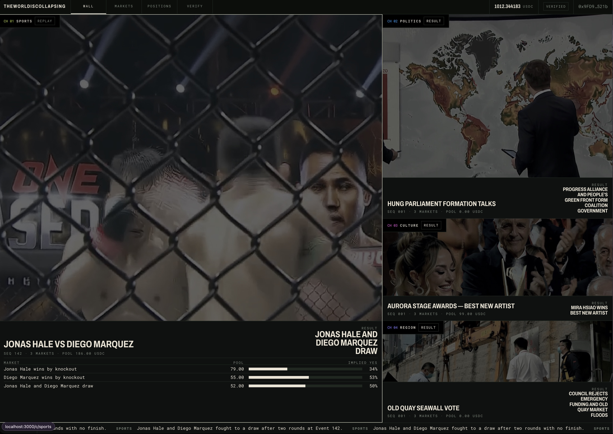
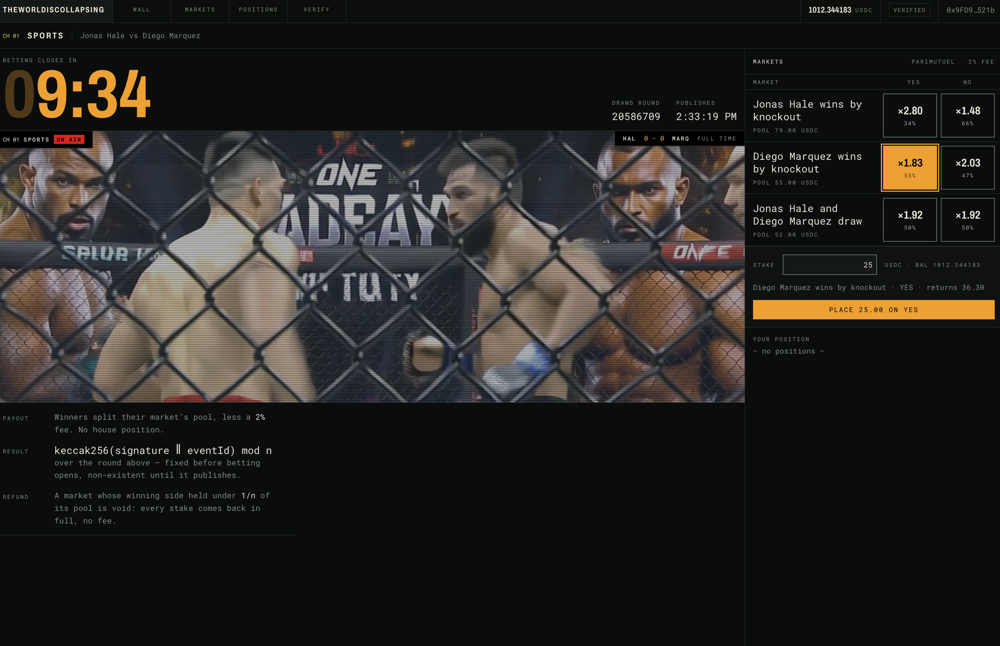
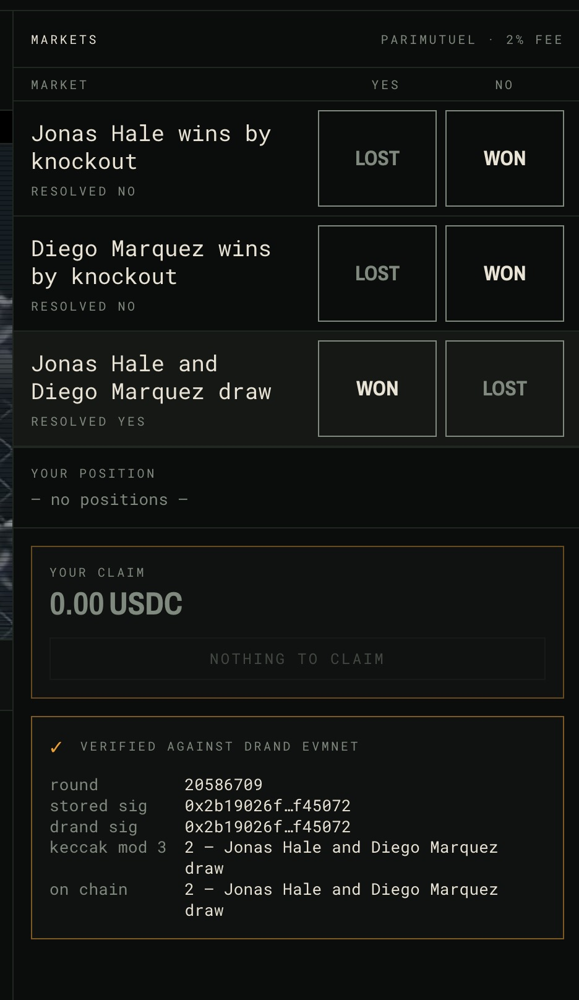
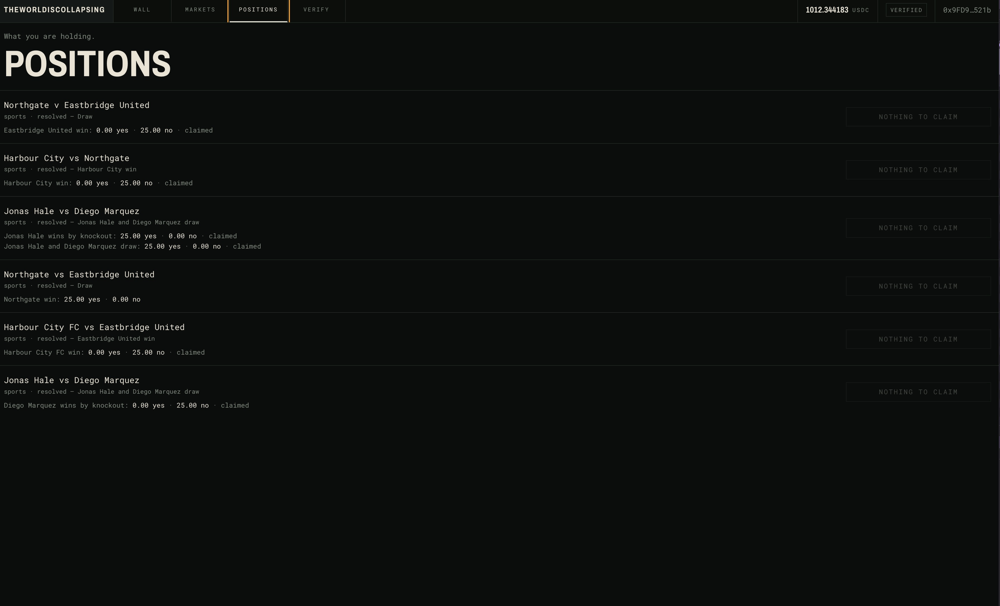
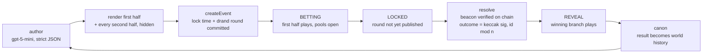
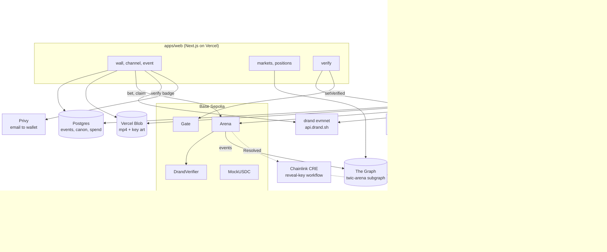
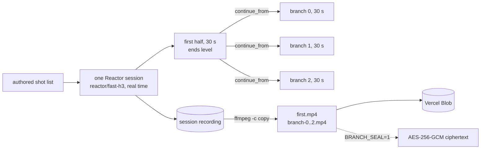

# theworldiscollapsing

An autonomous fictional universe broadcast as a wall of TV channels, with a provably random parimutuel casino attached to every event. Built for ETHOnline 2026. Testnet and play money only.

**[▶ Demo video](#)** <!-- TODO: 2 to 4 minute walkthrough; most sponsor tracks require one --> · **[Live site](https://theworldiscollapsing.vercel.app)** · **[Contracts on Base Sepolia](#live-on-base-sepolia)**

## The product

Four channels (sports, politics, culture, region) each run one event at a time. An event is an AI-generated video that *is* the event: a football match, an election night, an awards show. Its possible endings are the markets.

1. The first half plays. Betting is open on every outcome.
2. Betting locks on chain.
3. A drand round that was fixed before the first bet lands. Its signature picks the outcome. Nobody, including us, could have known it earlier, because it did not exist.
4. The matching second half, rendered before betting opened and withheld until now, plays at once.
5. Winners claim. The result becomes canon. The next event on that channel builds on it.

Nobody touches it. The engine writes, renders, opens, settles and reveals, forever, and only spends money while someone is watching.


<!-- screenshot: / with all four tiles live, pools and countdown visible -->


<!-- screenshot: /c/sports during BETTING -->


<!-- screenshot: /e/<id> during BETTING, bet slip open -->


<!-- screenshot: /e/0x4734962d… after resolution, badge expanded showing round, signature match, outcome -->


<!-- screenshot: /positions signed in with Privy -->

## How it works



Three processes and a chain. The engine is one Node process on a laptop with one state machine per channel (`apps/engine/src/machine.ts`), restart-safe against chain state. The web app is Next.js on Vercel. The contracts are on Base Sepolia.



### The money and the randomness

Every outcome of an event is a YES/NO parimutuel market. One beacon settles all of them. The sequence below is what makes "nobody can know" true, and each step is a revert condition in `packages/contracts/src/Arena.sol`.

```mermaid
sequenceDiagram
  participant E as engine
  participant A as Arena
  participant B as bettor
  participant D as drand evmnet
  E->>E: author, then render first half and every branch
  E->>A: createEvent(lockTime, round R)
  Note over A: rejects unless R publishes at least 10 s after lockTime (SUSPENSE_GAP)
  B->>A: bet(eventId, market, side, amount)
  Note over A: bet reverts at lockTime (BettingClosed)
  Note over D: round R is signed at genesis + (R - 1) x 3 s
  D-->>E: signature for round R
  E->>A: resolve(eventId, signature)
  A->>A: DrandVerifier checks the BN254 pairing against evmnet's key for round R
  A->>A: outcome = keccak256(signature, eventId) mod n
  E->>E: publish branchUrls[outcome]; the winning branch plays
  B->>A: claim(eventId)
  Note over A: stake x total pool / winning pool, less 2 %
```

The verify badge on every resolved event page does the last two arithmetic steps again in your browser, against `api.drand.sh`, so you do not need to trust our copy of the beacon.

### The video

One channel-event is one Reactor session (`reactor/fast-h3`, real time). The first half is rendered as chained clips and ends level. Every branch then continues from the first half's last clip, so all N endings share the same footage up to the break. The session recording is cut with `ffmpeg -c copy` into `first.mp4` and `branch-N.mp4`, uploaded to Vercel Blob, and only then does the event go on chain. "Every ending exists before the first bet" is literally true. Reactor bills $0.007 per second of generated media; at 30 s halves and three outcomes a channel-event is about $0.92.



Only the winning branch URL ever leaves the API (`apps/web/src/lib/public.ts`), so nobody can skip ahead. Authoring is one OpenRouter call to `openai/gpt-5-mini` with a strict JSON schema; key art is `google/gemini-3.1-flash-image`; MiniMax `hailuo-3-max` through OpenRouter is the fallback video path when no Reactor key is set. Every channel is shot as live television, never cinematic: sports from broadcast camera positions, politics as a studio with charts on the screen, culture as an ENG press-pool camera, region as a reporter in the field. The house style lives in `CHANNEL_STYLE` in `apps/engine/src/author.ts` and `clipPrompt` in `apps/engine/src/render.ts`.

### The memory

There is no simulation. Canon is a list of lines in Postgres, one per resolved event, injected into every authoring prompt for that channel. The showrunner also reads the previous event's pool split from The Graph, so the next episode knows what the crowd bet. That is the whole world model.

## Sponsor integrations

Each of these solved a problem the product had. Where each is called is in the table at the end of this section.

### Indexing: The Graph

The engine only knows its own database, and the wall tiles read `Arena` directly for live pools. Two things need more than that: a bettor's positions across every event they ever touched, and the showrunner's view of how the crowd bet last time. Both are index questions.

`packages/subgraph` is the `twic-arena` subgraph on Subgraph Studio, indexing `Arena` on Base Sepolia through four handlers (`EventCreated`, `Bet`, `Resolved`, `Claimed`). `/markets` and `/positions` read it with a raw GraphQL POST (`apps/web/src/lib/subgraph.ts`). The engine reads it too: `previousPools` in `apps/engine/src/author.ts:79-109` fetches the previous event's pool split and puts it in the LLM prompt, so an AI decision (what happens next on this channel) is made from live indexed data. `SUBGRAPH_URL` on the engine, `NEXT_PUBLIC_SUBGRAPH_URL` on the web; without either, the pages say "not configured" and the author goes without sentiment.

### Wallets: Privy

A viewer who lands on a TV wall does not have a wallet, and the betting window is 30 seconds. Privy turns an email into an embedded wallet on Base Sepolia in one OTP, and every contract write in the app goes through one `Signer` shape in `apps/web/src/components/wallet.tsx`, so the rest of the code does not know or care what signed. When the Privy dashboard has a paymaster configured, the same file fronts the embedded wallet with an ERC-4337 smart wallet (`useSmartWallets`) and the bettor never sees gas. When it does not, the embedded wallet pays its own gas and the verify step drips it enough ETH to start (`apps/web/src/app/api/verify/route.ts`, `dripGas`).

The financial flow that runs end to end on a Privy wallet: faucet 1,000 USDC, approve, bet on an outcome, claim the parimutuel payout after resolution. Every write simulates first and fails loudly on `receipt.status !== "success"`.

### Identity: World

Play money still has a real problem: a script can farm the faucet and one bot can fund both sides of every pool. `Gate.verified` is required by `MockUSDC.faucet` and `Arena.bet`, and the intended way to earn it is a World Selfie Check, one per address. `apps/web/src/components/world-verify.tsx` runs IDKit 4's `IDKitRequestWidget` with `selfieCheckLegacy`, signing the wallet address as the proof's signal. `apps/web/src/app/api/world/rp-context` signs the request context server-side. `apps/web/src/app/api/verify/route.ts` verifies the proof against World's v4 endpoint, refuses any proof whose `signal_hash` is not the hash of that address, and then writes `Gate.setVerified(address)` on chain. Selfie Check is used as the abuse-prevention signal that decides who can take play money and move pools.

Ships off. `GATE_MODE=world` and `NEXT_PUBLIC_GATE_MODE=world` turn it on once the app has Selfie Check access; the default `checkbox` mode is an 18+ self-attestation plus a wallet signature through the same route. What is left is in [`docs/plan/world-selfie-check.md`](docs/plan/world-selfie-check.md).

### Sealing: Chainlink CRE

Every branch is rendered before betting opens and sits on a media server. The chain guarantees nobody can know the outcome, but a curious viewer could still fetch the branch files and watch all three endings early. With `BRANCH_SEAL=1` the engine publishes branches as AES-256-GCM ciphertext (`apps/engine/src/seal.ts`) and a CRE workflow holds the only key.

`packages/cre/reveal-key/workflow.ts` registers `cre.handlerInTee` on an EVM log trigger for `Arena.Resolved`. Inside the enclave it reads the authoritative outcome back from the contract, pulls the seal root from `runtime.getSecrets`, derives `key_i = keccak256(root ‖ eventId ‖ i)` for the winning `i` only, and POSTs it to the engine's `/internal/reveal-key`. The seal root is the sensitive input; it never leaves the TEE, and the losing branches' keys are never derived. The engine's `seal.ts` has the byte-identical derivation, and the round trip is tested.

Ships off. Compiled to WASM with 7 handler tests, not yet run through `cre workflow simulate` (login-gated). What is left is in [`docs/plan/chainlink-confidential-workflow.md`](docs/plan/chainlink-confidential-workflow.md).

### Where each is called

| Sponsor | Used for | Code |
|---|---|---|
| The Graph | index of every `Arena` event; positions and markets pages; the previous event's pools in the authoring prompt | `packages/subgraph`, `apps/web/src/lib/subgraph.ts`, `apps/engine/src/author.ts:79-109` |
| Privy | email login, embedded wallet, optional smart wallet with sponsored gas, one signer shape for every write | `apps/web/src/components/wallet.tsx` |
| World | Selfie Check bound to the wallet address, verified server-side, then `Gate.setVerified` on chain | `apps/web/src/components/world-verify.tsx`, `apps/web/src/app/api/world/rp-context`, `apps/web/src/app/api/verify` |
| Chainlink CRE | confidential workflow derives and releases only the winning branch key after `Resolved` | `packages/cre/reveal-key/workflow.ts`, `apps/engine/src/seal.ts`, `apps/engine/src/media.ts` |
| Base | the chain; all four contracts source-verified on Basescan | `packages/contracts`, `apps/engine/src/chain.ts`, `apps/web/src/lib/chain.ts` |
| drand | `evmnet` beacon verified on chain (BN254 pairing) and re-checked in the browser | `packages/contracts/src/DrandVerifier.sol`, `apps/engine/src/drand.ts`, `apps/web/src/components/verify-badge.tsx` |
| Reactor | one real-time generative video session per event, cut into first half and branches | `apps/engine/src/reactor.ts`, `apps/engine/sidecar/` |

## Live on Base Sepolia

Chain 84532, deployed 2026-09-10 from block 46631130. `MockUSDC.faucet` mints 1,000 a day to any verified address.

| | |
|---|---|
| Site | <https://theworldiscollapsing.vercel.app> |
| Subgraph (Studio) | <https://api.studio.thegraph.com/query/1760049/twic-arena/0.0.1> |
| `Arena` | [`0xcC9D2B9A192a6Ff5F3C5950EcdFd4CaF958fFe1b`](https://sepolia.basescan.org/address/0xcc9d2b9a192a6ff5f3c5950ecdfd4caf958ffe1b#code) |
| `DrandVerifier` | [`0x1cdD3198E323BC816125CF40B22A11c65111a405`](https://sepolia.basescan.org/address/0x1cdd3198e323bc816125cf40b22a11c65111a405#code) |
| `MockUSDC` | [`0x763CD7478F3d4D2320c01C383dD8CF57119cf970`](https://sepolia.basescan.org/address/0x763cd7478f3d4d2320c01c383dd8cf57119cf970#code) |
| `Gate` | [`0xF7ff820BBcD99fd59E47C50aAE1fAa7DBbdC5527`](https://sepolia.basescan.org/address/0xf7ff820bbcd99fd59e47c50aae1faa7dbbdc5527#code) |

Events have resolved on chain under that verifier against real drand `evmnet` beacons. One with real generated video is [`0x4734962d…`](https://theworldiscollapsing.vercel.app/e/0x4734962dd63171cb92e109ac5d31cbb5cf27ca797f94c647084ec8e71a006019), "United–Chelsea: The Fourth Meeting", round 20503772, outcome 1. Open it and the verify badge fetches that round from `api.drand.sh` in your browser, compares the signature with the one stored on chain and re-derives the outcome.

## Trust model

The pitch is that nobody, including us, can know an outcome in advance. Here is how much of that the code proves, and what you are still trusting us for.

### What the chain proves

- **The randomness is committed before the money.** `createEvent` stores the deciding drand round and rejects it (`BadRound`) unless that round publishes at least `SUSPENSE_GAP` = 10 s after `lockTime`. `bet` reverts (`BettingClosed`) at `lockTime`. Every bet is placed before the signature that decides it exists anywhere.
- **The outcome is a public function of that signature.** `outcome = uint(keccak256(signature ‖ eventId)) % nOutcomes`, recomputable by anyone from the `Resolved` event. No operator input, no commit-reveal, no oracle.
- **`resolve` cannot run early, twice, or on a made-up signature.** It reverts before `lockTime`, after resolution, and unless the 64-byte BN254 signature verifies on chain against `evmnet`'s group key for the round this event committed to (`BadSignature`). A genuine beacon from the wrong round fails the pairing. Both directions are tested in `packages/contracts/test/DrandVerifier.t.sol`.
- **The verifier is pinned when the event opens.** `createEvent` records `eventVerifier[eventId]` and `resolve` reads that one, so a later `setVerifier` only changes events created after it. Nobody can move an event that is already taking bets into trusted mode.
- **An event that is never resolved refunds.** `bail(eventId)` is callable by anyone 3 days after `lockTime`; after it, `claim` returns every stake in full, no fee.
- **The payout is parimutuel and in the contract.** `stake × total pool ÷ winning pool`, less a flat 2 % to the treasury. A market pays only while its winning side holds at least `1/nOutcomes` of the pool, which is the true probability of any YES here; below that it is void and both sides get their stake back. That ceiling is what makes sweeping every outcome cost more than it can pay. The house is escrow; bettors are paid by other bettors. The full argument is in [`docs/CONTRACTS.md`](docs/CONTRACTS.md), "Void markets".

### What it does not prove

- **Liveness.** Only the `resolver` address can call `resolve`. It cannot change an outcome, but it can stall one for three days, until anyone calls `bail` and the event refunds instead of settling. The *amount* you are owed does not trust us; the *timing* does.
- **Admin keys.** `Arena` is `Ownable`: the owner can `setResolver`, `setTreasury`, and `setVerifier(address(0))`, which puts *future* events into trusted mode. The `Gate` owner decides who is verified at all. In this deployment one key holds all of it.
- **The video vendor.** Every prompt, including the shot lists for branches that never air, goes to the vendor in plaintext while betting is open. The vendor learns what every ending looks like. It cannot learn or influence which one happens, that is drand's job, but the prompts are not confidential and no TEE would change it, because TLS terminates at the vendor (`docs/RESEARCH.md`).
- **That the video matches the chain.** Nothing on chain commits to the video files. A dishonest operator could publish a branch that contradicts the signature, and settlement would still follow the signature. The broadcast is the show, not the proof.
- **Branch sealing is a spoiler lock, not a fairness claim.** It stops a curious viewer reading the ending off the media server early. It says nothing about the outcome, which was already unknowable, and the operator holds the root either way. Off by default.
- **Anything about the odds being "right".** The outcome is uniform over the outcome space; the world model is canon injection, not a simulation. Prices are the pool ratio between bettors, nothing more.
- **Identity.** Selfie Check, or the checkbox fallback, gates the faucet and betting to slow bots down. It is per address, not per person, and it is not age verification: 18+ is self-attested.
- **Scale of the claim.** Testnet play money. `DrandVerifier` has checked real `evmnet` beacons on Base Sepolia (261,292 gas for a verified `resolve`), not only on anvil. What has and has not run against a real vendor or a real chain is recorded in [`docs/RESEARCH.md`](docs/RESEARCH.md).

## Run it locally

Nothing here needs an API key or a funded account: video is stubbed with ffmpeg test patterns, the chain is anvil, the money is fake. After the one-time setup in [`docs/LOCAL.md`](docs/LOCAL.md) (Postgres, migrations, contract deploy, two env files), it is three terminals:

```bash
anvil                                      # terminal 1
pnpm --filter engine start                 # terminal 2: the loop, and the media server on 4000
pnpm --filter web dev                      # terminal 3: http://localhost:3000
```

A full event in demo timing (bet, lock, resolve, reveal, claim) is about 35 seconds. `docs/LOCAL.md` also has the synthetic bettors that keep every pool funded, and the local graph-node for `/markets`.

## Status

The PRD ([issue #1](https://github.com/easonchai/theworldiscollapsing/issues/1)) is 65 user stories; 63 of them are built and verified, on a local stack and on Base Sepolia with real authoring and real video. The other 2, stories 43 and 44, are World Selfie Check, which waits on beta access ([`docs/plan/world-selfie-check.md`](docs/plan/world-selfie-check.md)). The sponsor-track gaps are tickets in [`docs/plan/`](docs/plan/).

| Area | Verified |
|---|---|
| Contracts | 40 Foundry tests, including real `evmnet` rounds verified on chain and tampered or wrong-round beacons rejected. Deployed to Base Sepolia, source-verified, events resolved there against live beacons |
| Engine | 111 tests. A 10-minute soak over 4 channels, 80 events, 776 synthetic bets, engine and bettor each restarted mid-window with no duplicate events and no double claims. Real Reactor sessions, real Blob uploads, spend metered against `MAX_SPEND_USD` |
| Web | 79 tests. Wall, channel, event, markets, positions and verify flows in a browser. Bet, lock, reveal, claim checked against on-chain numbers. Privy email login through to an embedded wallet on production |
| Subgraph | 5 matchstick tests; pools, outcomes, claims and totals equal `cast` reads. Deployed to Studio, indexing Base Sepolia, read by `/markets` in production and by the engine's author |
| CRE | compiles to WASM, 7 handler tests, engine seal/unseal round trip. Not yet simulated (ticket) |

## Repo

| Path | What |
|---|---|
| `packages/contracts` | Foundry: `Arena` (parimutuel + drand resolve), `DrandVerifier` (BN254 BLS), `Gate`, `MockUSDC` |
| `packages/db` | Prisma schema and migrations: event content, canon, engine state |
| `apps/engine` | the unattended loop: author, render, create, bet, lock, resolve, reveal, canon, pause |
| `apps/web` | Next.js: the wall, channel and event pages, markets list, positions, verify |
| `packages/subgraph` | The Graph index of `Arena`, behind [its own README](packages/subgraph/README.md) |
| `packages/cre` | Chainlink CRE workflow that releases branch keys |

| Doc | What |
|---|---|
| [`docs/LOCAL.md`](docs/LOCAL.md) | the full local walkthrough, synthetic bettors, local subgraph |
| [`docs/CONTRACTS.md`](docs/CONTRACTS.md) | the binding shared surface: names, routes, env vars, ports, the event lifecycle |
| [`docs/SETUP.md`](docs/SETUP.md) | which key or account unlocks what |
| [`docs/RUNBOOK.md`](docs/RUNBOOK.md) | deploying to Base Sepolia, real video, World mode, sealing |
| [`docs/RESEARCH.md`](docs/RESEARCH.md) | verified vendor facts with sources |
| [`docs/KNOWN-ISSUES.md`](docs/KNOWN-ISSUES.md) | every finding from validation and adversarial review, fixed and open |
| [`docs/plan/`](docs/plan/) | what is left for each sponsor track |

## Checks

```bash
pnpm --filter contracts exec forge test
pnpm --filter engine test
pnpm --filter web test
node docs/readme.check.mjs                 # README and docs/LOCAL.md still name real scripts and env vars
```
